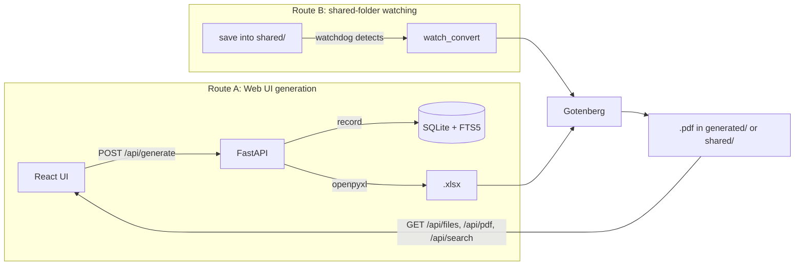

[🇯🇵 日本語](README.md) | [🇬🇧 English](README.en.md)

# excel-kanri

[](https://github.com/yktsnet/excel-kanri/actions/workflows/ci.yml)

A clone-and-use toolkit that retrofits web-form document generation, automatic PDF conversion of a shared folder, and full-text search onto an existing Excel-based workflow — without breaking it (generic modules + a FastAPI/React reference implementation).


## Quick Start

### Prerequisites

- [Docker Desktop](https://www.docker.com/products/docker-desktop/)

### Setup

```bash
docker compose up -d --build
```

- App: http://localhost:8000

Since it starts with `DEMO_MODE=true`, the login screen shows `viewer` / `editor` tabs with demo credentials pre-filled. Log in as `editor` to walk through the whole flow: document generation → list & preview → search.

## Overview

Let the workplace keep its Excel-based document workflow, while making documents from either of two input routes viewable and searchable as PDFs.

- **Route A (Web UI generation)**: form input → recorded in SQLite → values filled into a template Excel → converted to PDF
- **Route B (shared-folder watching)**: place or save an Excel file in `shared/` → change detected → PDF auto-updated (overwritten in place)

The first application is move-in/move-out paperwork for a property management company, but all domain-specific artifacts (templates, mappings, seed data) live only in `examples/mansion/`. Swap them out and the toolkit transfers to another industry.

## Architecture



Three layers with one-way, bottom-up dependencies.

- `packages/`: generic modules with no dependency on the app (`template_fill` = mapping YAML + data → xlsx filling, `watch_convert` = directory watching + debounce). Contains no domain vocabulary
- `app/`: FastAPI + React. The web application assembled from the packages (also generic)
- `examples/mansion/`: the application example. Template Excel files, mapping YAML, seed data (fictional forms only)

## Tech Stack

| Layer | Technology | Reason |
|---|---|---|
| Backend API | Python / FastAPI | Lives in the same Python runtime as `watchdog` and `openpyxl`, keeping the self-hosted setup complete with nothing more than `pip install` |
| Frontend | React + Vite + TypeScript | FastAPI serves the build output statically, so production needs no separate web server such as Nginx |
| Styling / UI | Tailwind CSS, shadcn/ui | shadcn/ui copies components into the repo for free customization, and ships the business-app staples (Table, Form, Dialog) |
| Database | SQLite + FTS5 | One file-based embedded DB covers both record-keeping and full-text search, avoiding a separate search backend |
| PDF conversion | Gotenberg (Docker container) | Delegates to a dedicated conversion container over HTTP instead of installing LibreOffice on the app server, eliminating `subprocess` management and keeping the app code simple |
| Auth | JWT (passlib + python-jose) | Roles are limited to two values, `viewer` / `editor`, with no admin role and no separate session store |

## Design Decisions

- **Three layers with domain separation**: the property-management vocabulary exists only inside templates, mappings, and form definitions; the machinery (filling, watching, converting, searching, viewing) turned out to be fully domain-free. The boundary is expressed in the structure itself (`packages/` → `app/` → `examples/`) from day one, anticipating reuse in other industries
- **Distribution is a clone reference**: no PyPI publication. Registry publication carries ongoing costs (versioning, backward compatibility, English docs), so the cost of generalization is paid only once real users appear
- **Demos are self-contained in the repo**: since distribution is a clone reference, the demo audience is developers (and future me). Each module ships a VHS `.tape` + GIF; the whole app is evaluated with a single `docker compose up`. A hosted demo URL is a supplement built on top of this, not a replacement
- **Search stops at FTS5**: the problem being solved (the effort of finding past documents) is covered by keyword search. Natural-language search (Gemini Text-to-SQL) is treated as a bonus rather than a differentiator, and deferred to post-MVP
- **Development targets WSL2, production targets a VPS / on-prem Linux**: on the WSL2 filesystem, edits saved directly from Windows Explorer or Excel propagate `inotify` events correctly, so Route B's file watching can be verified without an extra file-sharing server. Production assumes a separately provisioned shared directory such as Samba

## Usage

### Web App

| Operation | Role | Endpoint |
|---|---|---|
| Login | - | `POST /api/auth/login` |
| List document types | viewer / editor | `GET /api/documents/types` |
| Generate document (xlsx + pdf) | editor only | `POST /api/generate` |
| List files (generated + shared) | viewer / editor | `GET /api/files` |
| Serve PDF | viewer / editor | `GET /api/pdf/{path}` |
| Full-text search (Route A only) | viewer / editor | `GET /api/search?q=...` |

Route B needs no interaction with the web UI. Save an Excel file into `shared/` and its PDF is updated automatically and reflected in the list and search APIs above (search covers Route A output only).

Main environment variables (see [`.env.example`](.env.example) for details):

| Variable | Purpose |
|---|---|
| `DEMO_MODE` | `true` enables the demo login screen and seed data |
| `GOTENBERG_URL` | URL of the Gotenberg container that handles xlsx → pdf conversion |
| `JWT_SECRET` | JWT signing key. In production, replace with a value generated by e.g. `openssl rand -hex 32` |
| `MAPPING_DIR` / `GENERATED_DIR` / `SHARED_DIR` | Locations of mapping YAML, generated output, and the shared folder |
| `GEMINI_API_KEY` | For natural-language search (post-MVP, not implemented) |

### Package CLIs (`packages/`)

Each module under `packages/` works as a standalone CLI with no dependency on `app/`.

**`template_fill`** — generates an xlsx from a mapping YAML + data JSON.

```bash
python -m packages.template_fill mapping.yaml data.json -o out.xlsx
```


**`watch_convert`** — watches a directory and runs a command each time a file settles.

```bash
python -m packages.watch_convert shared/ --exec 'echo converted: {src}'
```


## Scope

### Focus

- Retrofitting an existing Excel workflow (web input, automatic PDF conversion, full-text search)
- Simple auth with only two roles, `viewer` / `editor` (no admin role)
- `packages/` are generic, `app`-independent modules reusable in other projects

### Out of Scope (post-MVP)

- Natural-language search (Text-to-SQL via the Gemini API)
- Deployment guide and Samba setup
- Publishing `packages/` to PyPI

## Development

Local development without Docker:

```bash
python -m venv .venv && source .venv/bin/activate
pip install -r requirements.txt
npm install
```

```bash
uvicorn app.main:app --reload   # backend :8000
npm run dev                     # frontend :5173
```

Verification:

```bash
python -m pytest       # unit tests for packages/
npm run typecheck       # TypeScript type check
npm run build           # frontend build (includes type check)
```

A `shell.nix` (`nix-shell`) is provided as an optional shortcut for Nix users; the steps above are canonical.
