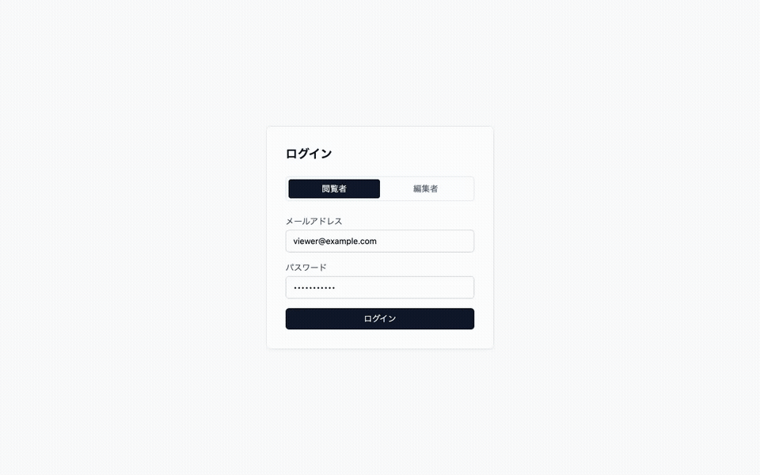
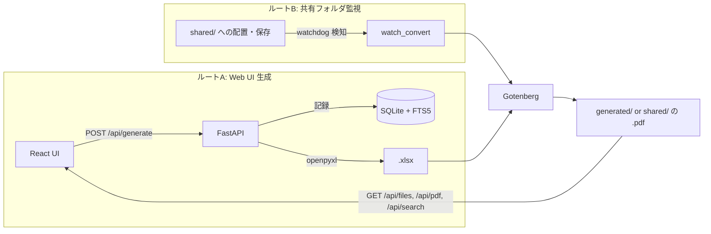

[🇯🇵 日本語](README.md) | [🇬🇧 English](README.en.md)

# excel-kanri

[](https://github.com/yktsnet/excel-kanri/actions/workflows/ci.yml)

既存の Excel 帳票運用を壊さずに、Web フォームからの書類生成・共有フォルダの PDF 自動変換・全文検索を後付けする、clone して使うツールキット（汎用モジュール群 + FastAPI/React リファレンス実装）。



## Quick Start

### Prerequisites

- [Docker Desktop](https://www.docker.com/products/docker-desktop/)

### Setup

```bash
docker compose up -d --build
```

- App: http://localhost:8000

`DEMO_MODE=true` で起動するため、ログイン画面に `viewer` / `editor` タブが出てデモ認証情報が自動入力される。`editor` でログイン→書類生成→一覧・プレビュー→検索まで一通り試せる。

## Overview

現場が Excel での帳票運用を続けたまま、2つの入力経路のどちらからでも書類を PDF として一覧・検索できるようにする。

- **ルートA（Web UI 生成）**: フォーム入力 → SQLite 記録 → テンプレート Excel に流し込み → PDF 変換
- **ルートB（共有フォルダ監視）**: `shared/` への Excel 配置・保存 → 変更検知 → PDF 自動更新（同名上書き）

最初の適用例はマンション管理会社の入居・退去手続きだが、ドメイン固有の実装（テンプレート・マッピング・シードデータ）は `examples/mansion/` にのみ置かれており、それらを差し替えるだけで別業種に転用できる構造になっている。

## Architecture



3層構成で、下から上への一方向依存を持つ。

- `packages/`: app に依存しない汎用モジュール（`template_fill` = マッピング YAML + データ → xlsx 流し込み、`watch_convert` = ディレクトリ監視 + デバウンス）。ドメイン語彙を含まない
- `app/`: FastAPI + React。packages を組み立てた Web アプリ本体（これも汎用）
- `examples/mansion/`: 適用例。テンプレート Excel・マッピング YAML・シードデータ（架空様式のみ）

## Tech Stack

| Layer | Technology | Reason |
|---|---|---|
| Backend API | Python / FastAPI | `watchdog`・`openpyxl` と同じ Python ランタイムに置くことで、`pip install` だけで完結するセルフホスト構成にするため |
| Frontend | React + Vite + TypeScript | ビルド成果物を FastAPI が静的配信し、本番稼働時に Nginx 等の別 Web サーバーを不要にするため |
| Styling / UI | Tailwind CSS, shadcn/ui | shadcn/ui はコンポーネントを手元にコピーする方式で自由にカスタマイズでき、Table・Form・Dialog 等の業務系コンポーネントが揃っているため |
| Database | SQLite + FTS5 | ファイルベースの組み込み DB 1つで記録と全文検索を両方賄い、別立ての検索基盤を持たずに済ませるため |
| PDF 変換 | Gotenberg（Docker コンテナ） | LibreOffice をアプリサーバーに直接インストールせず、変換専用コンテナへ HTTP で委譲することで `subprocess` 管理を無くしアプリコードを単純化するため |
| 認証 | JWT（passlib + python-jose） | ロールを `viewer` / `editor` の2値に絞り、管理者ロールや別建てのセッションストアを持たないシンプルな認証にするため |

## Design Decisions

導入判断に効く要点のみ。各判断の全文（何を捨てたか・どの境界で再検討するか）は [docs/design-decisions.md](docs/design-decisions.md) にある。

- **3層構成とドメイン分離**: マンション管理という語彙はテンプレート・マッピング・フォーム定義の中にしか存在せず、流し込み・監視・変換・検索・閲覧の機械部分は完全にドメインフリーだった。将来の別業種転用や切り出しを見据え、境界を最初から構造（`packages/` → `app/` → `examples/`）で表現している
- **配布形態は clone リファレンス**: PyPI へのパッケージ公開は行わない。レジストリ公開には versioning・後方互換・英語ドキュメントの継続コストが伴うため、汎用化のコストは実際に利用者が現れてから払う方針とした
- **デモは同梱物で完結させる**: 配布形態が clone リファレンスである以上、デモの受け手は開発者（と将来の自分）。モジュール単位は VHS の `.tape` 同梱 + GIF、アプリ全体は `docker compose up` 一発起動で、リポ単体で評価できる状態を保つ。常設デモ URL はこれを前提にした補助とする
- **検索は FTS5 まで**: 解決したい課題（過去書類を探す手間）はキーワード検索で足りる。自然言語検索（Gemini Text-to-SQL）は差別化ではなく加点要素と位置づけ、post-MVP とした
- **開発は WSL2 前提、本番は VPS / オンプレ Linux**: WSL2 のファイルシステムは Windows のエクスプローラー・Excel から直接編集・保存すると `inotify` イベントが正しく伝播するため、追加のファイル共有サーバーなしにルートBのファイル監視を検証できる。本番では Samba 等の共有ディレクトリを別途用意する想定

## Usage

Web App の API・環境変数・`packages/` の CLI 単体利用は [docs/usage.md](docs/usage.md) にある。概要だけ示す:

- **ルートA**: `POST /api/generate`（editor 限定）で書類を生成し、`GET /api/files` / `GET /api/pdf/{path}` / `GET /api/search` で閲覧・検索する
- **ルートB**: `shared/` への配置・保存が自動で PDF に反映される（Web UI 操作不要）
- **CLI**: `python -m packages.template_fill` / `python -m packages.watch_convert` で `app/` 抜きに単体利用できる

## Scope

### Focus

- 既存 Excel 運用への後付け（Web 入力・PDF 自動変換・全文検索）
- `viewer` / `editor` の2ロールのみのシンプルな認証（管理者ロールなし）
- `packages/` は `app` 非依存の汎用モジュールとして他プロジェクトへの流用が可能

### Out of Scope (post-MVP)

- 自然言語検索（Gemini API による Text-to-SQL）
- デプロイ手順書・Samba 設定の整備
- `packages/` の PyPI 公開

## Development

Docker を使わないローカル開発:

```bash
python -m venv .venv && source .venv/bin/activate
pip install -r requirements.txt
npm install
```

```bash
uvicorn app.main:app --reload   # バックエンド :8000
npm run dev                     # フロントエンド :5173
```

検証:

```bash
python -m pytest       # packages/ のユニットテスト
npm run typecheck       # TypeScript 型チェック
npm run build           # フロントエンドビルド（型チェック込み）
```

Nix ユーザー向けに `shell.nix`（`nix-shell`）も用意しているが任意のショートカットであり、上記手順が正とする。
